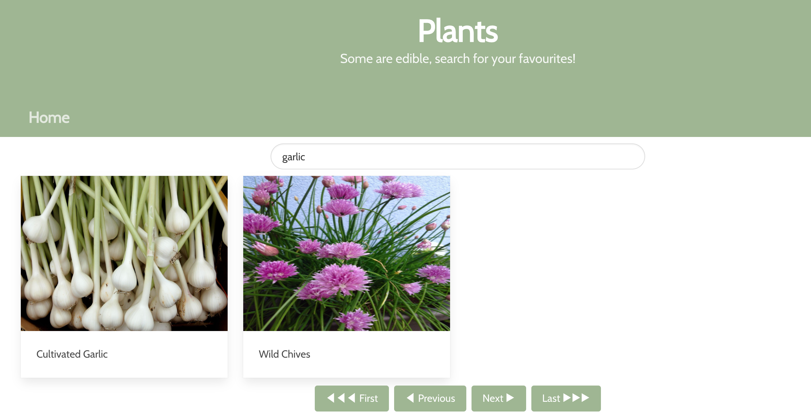

# Reactathon | sei50-project II
> Consume a RestAPI with React and Axios.  A paired project over approx a day and half.

## Table of contents
* [General info](#general-info)
* [Screenshots](#screenshots)
* [Technologies](#technologies)
* [Setup](#setup)
* [Features](#features)
* [Status](#status)

## General info
Trefle is a global botanical API, https://trefle.io  
It is an open sourced dataset with over 1 million plants.  To narrow the focus for this **Reactathon** project the focus was on **edible plants**.

## Screenshots

In the below image a search for garlic displays 2 edible plants from the family Amaryllidaceae.  Members of the family characteristically feature bulbs or underground stems and straplike leaves.

## Technologies

Front End:
- React
- JavaScript
- Axios
- SCSS
- Bulma
- react-responsive-carousel
- React router dom

Dev Tools:
- Netlify
- Git 
- Github
- VSCode
- Insomnia
- Eslint
- Google Chrome dev tools

## Setup
Deployed with netlify the React API webapp is hosted here:
https://clever-joliot-1b11e8.netlify.app/

`yarn start` run the development server

`yarn run build` create a build directory

`netlify deploy --build` deploy with netlify

## Code Examples

Here is a sample of the API request with an edible plant filter.  The token was stored in the config variable and a proxyUrl was required.

`const proxyUrl = 'https://cors-anywhere.herokuapp.com/'`

`const baseUrl = proxyUrl + 'https://trefle.io/api/v1/'`

`return axios.get(`${baseUrl}/species?filter[edible]=true&page=${pageNum}`, config)`

## Features
List of features ready & TODOs for future development
* search via regions, this idea was initiated with DropDownFilter.js though not implemented
* explore other API filter options

## Status
Project is: _currently_shelved (while focusing on other projects!)